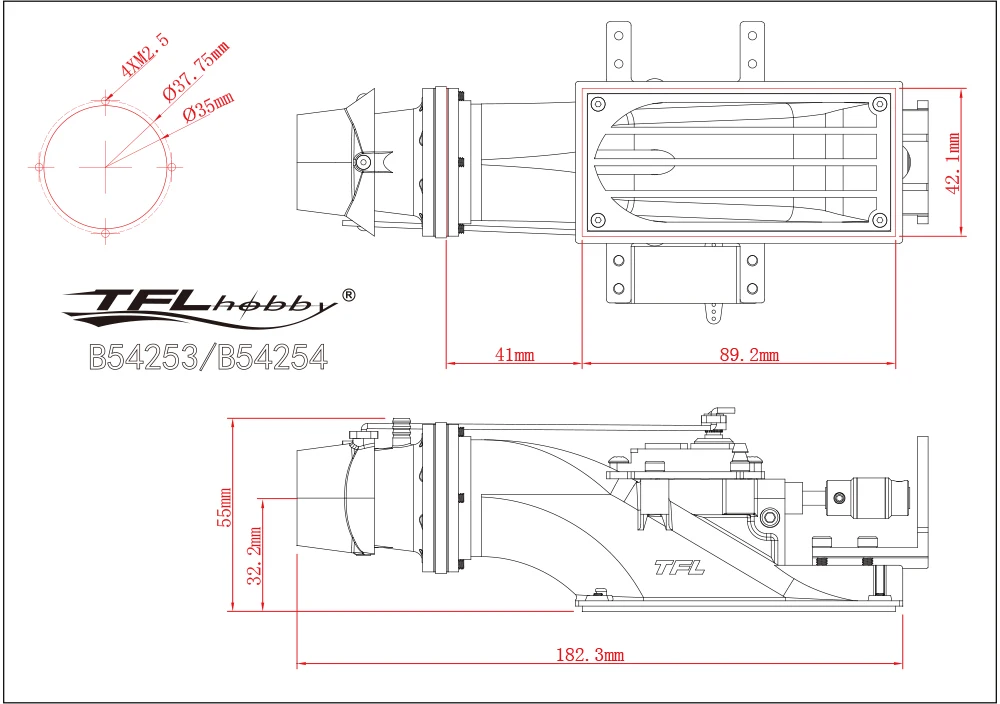

# Jet Catamaran — 3D-printed twin water-jet boat

**Planned custom build.** A catamaran-hull surface craft, **3D-printed shell coated in fiberglass**,
driven by **two TFL 30 mm water-jet drives** (one jet per hull). This is the first *surface* craft in
the domain — everything else here flies — but it reuses the same ecosystem (ELRS radio, 4S LiPo
packs, HOTA charger, water-cooled brushless ESCs).

Status: **hull being designed (CAD in progress); no parts purchased yet.** Specs below are the
intended build; motor/impeller tier, steering scheme, and battery are open decisions.

## Concept

- **Catamaran (twin-hull)** printed in sections, then **fiberglassed** for a watertight, stiff,
  smooth shell.
- **Dual jet propulsion** — a TFL 30 mm water-jet in each hull. Jets (vs. props) mean no exposed
  running gear, shallow-water capability, and strong low-speed maneuvering.
- **Steering** by the jets themselves: either vectored/steering nozzles or **differential thrust**
  between the two drives (open decision — see below). Each TFL unit also carries a **reversing
  bucket** for reverse/braking.

## Propulsion — TFL 30 mm water-jet (×2)

The core purchase is the **TFL (TFLhobby) "T-Jet" 30 mm water-jet drive**, model family **B54253**.
Manufacturer specs: **nylon** jet body, **carbon-fiber** servo bracket, aluminum-alloy hardware;
**~104.3 g** per unit; **~3 kg thrust**; recommended hull length **≤ 75 cm**. Reversing bucket,
water-cooled motor can.

TFL sells it under factory sub-SKUs (**distinct from the AliExpress reseller's "Combo A–D" bundles**):

| TFL SKU | Contents | Maps to tier below |
|---------|----------|--------------------|
| **B54253-A** | bare pump — **no motor / servo** | add your own motor + ESC + servo |
| **B54253-C** | pump + **SSS 2960 KV2200** motor set | Standard |
| **B54253-D** | pump + **SSS 3660 KV2726** motor set | Upgrade |

Two propulsion tiers, then, per drive:

| Tier | Impeller | Motor | ESC | Battery | Notes |
|------|----------|-------|-----|---------|-------|
| **Standard** (lower cost) | **2-blade** | SSS 2860/2960 KV2200 (water-cooled can) | **Hobbywing SeaKing 90A** water-cooled | 4S (14.8 V) | The "smaller motor + 90 A ESC" option |
| **Upgrade** (more thrust) | **4-blade** | SSS 3660 KV2726 (water-cooled can) | 120A water-cooled | 4S (14.8 V) | Higher current draw |

- **Steering / reverse servo:** TFL spec calls for a **3 kg (metal-gear) servo** per drive to work
  the steering nozzle + reversing bucket — **not included** in the pump listings.
- Because it's a **catamaran with two drives**, budget **2× of everything**: 2 pumps, 2 motors,
  2 ESCs, 2 impellers, and 1–2 steering servos depending on the steering scheme chosen.
- The listing photos label the standard can as `SSS MOTOR 2860 KV2200`; the flight-model.com mirror
  lists it as `2960KV2200`. Same 28/29-series, KV2200 — confirm the exact can when ordering.

Parts on hand vs. still-to-buy: [`inventory.md`](inventory.md).

## Hull interface dimensions (for the 3D print)

These are the numbers the CAD hull has to be built around — pulled from the TFL dimension drawings
for the 30 mm unit. **The B54253/B54254 drawing is the complete one** (bolt pattern + bore + intake
window); the plain B54253 drawing is a subset. Both saved locally:

| Interface | Dimension | What it drives in the print |
|-----------|-----------|-----------------------------|
| **Nozzle / transom flange bolt pattern** | **4 × M2.5**, on a **Ø37.75 mm** bolt circle | Transom mounting holes (bosses/heat-set inserts) |
| **Nozzle bore (outlet)** | **Ø35 mm** | Transom through-hole the nozzle passes/seals through |
| **Nozzle protrusion aft of flange** | **41 mm** | How far the outlet sticks past the transom |
| **Intake / grille body length** | **89.2 mm** | Length of the bottom-of-hull water-intake cutout |
| **Mounting-plate / body width** | **42.1 mm** | Width of the intake cutout + mount pads (min. inner hull width) |
| **Overall height (nozzle CL → intake base)** | **55 mm** (intake base sits **32.2 mm** below nozzle CL) | Internal hull depth needed to seat the drive |
| **Overall length of the unit** | **182.3 mm** | Fore-aft space each drive occupies in a hull |

Second (subset) drawing for cross-check: [`images/tfl-30mm-jet-dimensions-B54253.png`](images/tfl-30mm-jet-dimensions-B54253.png)
— shows body width **39.3 mm**, body length **86.3 mm**, height **55 mm**, overall length **172.3 mm**
(minor variant / measured to different datums; treat the B54253/B54254 drawing as authoritative).

> ⚠ Each hull must fit one full **182.3 mm × ~42 mm × 55 mm** drive with a flat, sealed transom face
> (Ø35 bore, 4×M2.5 @ Ø37.75) and a bottom intake window (~89 × 42 mm) fed with a clean water path.
> Leave room for the motor can + water-cooling nipples aft of the intake and the steering-servo linkage above.

### ⚠ Design decisions to resolve before ordering/printing

- **Steering scheme** — vectored steering nozzles (servo per drive) **vs.** differential thrust
  (fixed nozzles, steer by throttling each jet). Differential is simpler mechanically but needs
  mixing at the TX/RX; vectored nozzles need 1–2 servos + linkages routed through the deck.
- **Propulsion tier** — 2-blade/90 A/SSS-2860 vs. 4-blade/120 A/SSS-3660. Drives current draw,
  battery choice, and cost (×2).
- **Battery & power budget** — two water-cooled ESCs on 4S pull serious current. One shared 4S pack
  vs. one per hull; capacity/C-rating TBD. Reuse the fleet's 4S packs or buy dedicated marine packs.
- **Water-cooling plumbing** — jets are self-pickup (cooling water tapped from the pump); route
  silicone lines through each motor can's cooling jacket and out a transom exit. Plan the runs.
- **Hull sealing / waterproofing** — ESC/RX/battery bay must be sealed (fiberglass + hatch gasket);
  plan cable glands for the motor phase wires and servo leads through bulkheads.
- **Radio** — reuse the fleet **ELRS** stack (TX16S, bind phrase `dwdrones`) with a surface-suitable
  RX, or a dedicated surface radio. Min channels: throttle ×(1–2) + steering + reverse.

## Hull design (Onshape, parametric)

The hull is a **parametric Onshape model** driven entirely by a variable table — change the beam or
tunnel and the whole sponson regenerates. **Source of truth: [`sponson_variables_v2.csv`](sponson_variables_v2.csv)**
(import as an Onshape variable table). The individual per-plane DXFs are **superfluous** now that the
sections are variable-driven; only an overlay snapshot is kept for reference.

Files in this project:

- [`sponson_variables_v2.csv`](sponson_variables_v2.csv) — the master/derived/station variables
  (**authoritative** — this is what gets tweaked).
- [`sponson_reference_v1.png`](sponson_reference_v1.png) — **v1 snapshot** (illustrative, not
  regenerated on every tweak): 3-panel layout guide — all sections overlaid (stern view), anatomy of
  one section (keel → chine → sheer, deadrise), and the side-view guide curves (keel/rocker, chine,
  sheer).
- [`all_stations_overlaid_v1.dxf`](all_stations_overlaid_v1.dxf) — **v1 snapshot** of all station
  profiles overlaid.

> The `_v1` PNG/DXF predate the `v2` variable table and are kept only to picture the layout — they
> can **lag the CSV** (e.g. station count/spacing) and are intentionally **not re-exported** on every
> change. When they conflict with `sponson_variables_v2.csv`, the CSV wins. The section geometry is
> fully reconstructable from the variables (see below), so the images are convenience, not a dependency.

### Form

Twin **deep-V planing sponsons** with a **flat aft running pad**, joined by a tunnel/wing platform.

| Master parameter | Value | Meaning |
|------------------|-------|---------|
| `overall_width` (beam) | **250 mm** | boat beam |
| `length_multiplier` | 2.2 | → **`overall_length` = 550 mm** |
| `tunnel_width_ratio` | 0.4 | tunnel = 40% of beam → each **`sponson_width` = 75 mm** |
| `shell_thickness` | 1.5 mm | printed wall |
| `deck_clearance` | 8.5 mm | air gap above pump for tubes/wires |
| `waterline_offset` | 36 mm | draft (float-check split) |
| `wing_length_ratio` / `wing_height` | 0.69 / 10 mm | tunnel platform length (≈380 mm) / plate thickness |
| `intake_boss_margin` | 6 mm | flat-pad margin around the intake flange |

- `hull_scale = sponson_width / 75 mm` — **= 1.0 at 250 mm beam**, so the section table is authored
  at a 75 mm sponson and scales with beam.
- **11 stations** at `plane_offset = 550/11 ≈ 50 mm` spacing: **S10 = transom** (flat pad, 0°
  deadrise) → **S1 = bow** (45° deadrise, deep V); rocker starts ~S6; S8 is intentionally vestigial
  (sits inside the pump-driven pad extrude). Each section is defined by width, deadrise, keel-Z
  (rocker) and sheer-Z, with chine-Z derived.

### Reconstructing a section from the variables

Each station is a hard-chine section defined by four numbers — `spN_wid`, `spN_deadrise`,
`spN_keelz`, `spN_sheerz` (all ×`hull_scale`) — plus the derived `spN_chinez`. Working in the
station's section plane, Y = transverse (0 = keel centerline), Z = up from the **pad plane (Z = 0
datum)**:

1. **Keel** point at `(0, keelz)` — bottom centre of the V; `keelz` is the **rocker** (how far the
   keel is lifted off the pad datum at that station; 0 at the transom, rising toward the bow).
2. **Chine** point at `(wid/2, chinez)`, where **`chinez = keelz + (wid/2)·tan(deadrise)`** — the
   hard chine corner (keep it crisp). `wid` is the chine beam (max width); `deadrise` is the V angle
   from horizontal.
3. **Sheer** point at `(wid/2, sheerz)` — the top edge / deck line, directly above the chine
   (topsides vertical). `sheerz` is the deck height at that station.
4. **Mirror** keel→chine→sheer to port (−Y) and **close across the deck** at the top.

Sweep the stations along three **guide curves** — keel line (`keelz` vs. X), chine line (`chinez`
vs. X), sheer line (`sheerz` vs. X) — and **loft** between them. Constraints baked into the table:

- **Aft (running-pad) region is extruded, not lofted** — S10/S9 are a flat pad (`deadrise = 0`), and
  S8 is deliberately **vestigial** (flattened, sits inside the pump-driven pad extrude) so the loft
  still closes if the pad ever shrinks. The V only *begins* at **S7** (`deadrise 8°`); rocker starts
  ~S6.
- **Bow** ends in a rounded **stem cap**; keep `sp1_deadrise ≤ 45°` so the chine stays under the
  sheer (`sp1_side_check = sheerz − chinez` **must stay positive**, or the bow section degenerates).
- **`hull_scale`** scales every `wid`/`keelz`/`sheerz` together (= 1.0 at 250 mm beam), so the whole
  section family resizes with beam without re-authoring.

So: import the CSV as the variable table, drop a sketch per station using the keel/chine/sheer rule
above, loft S7→S1, extrude the S10→pad region flat, cap the bow — no per-plane DXF needed.

### Pump ⇄ hull coupling (why the drive dimensions matter)

The `PUMP -` variables are lifted **directly from the TFL dimension drawing** above, and they *drive*
the hull, so the two stay consistent:

- **Deck datum height:** `sponson_height = jet_drive_unit_height (55) + shell_thickness (1.5) +
  deck_clearance (8.5) = 65 mm`.
- **Flat running-pad length (from transom):** `shell (1.5) + intake_to_back_wall (41) +
  intake_length (89.2) + boss_margin (6) = 137.7 mm` — this region is **extruded flat, not lofted**,
  so the intake flange and transom mount land on true-flat surfaces.
- **Transom nozzle cutout:** modeled at `jet_drive_outlet_hole_diam = 36 mm` (drawing says Ø35 nozzle
  OD) with the **4×M2.5 @ Ø37.75** bolt circle — ⚠ CSV flags *"was 34, must clear the 35 nozzle —
  verify on real unit"*; confirm bore + bolt circle against the physical drive before final print.

## Status

- [x] Hull section scheme + parametric variable table built (Onshape, `sponson_variables_v2.csv`)
- [x] Drive envelope captured and wired into the hull as pump-driven variables
- [ ] Hull CAD finalized (dimensioned to the drive envelope above)
- [ ] Steering scheme chosen (vectored nozzle vs. differential thrust)
- [ ] Propulsion tier chosen (2-blade/90 A vs. 4-blade/120 A)
- [ ] Parts ordered (2× drive + motors + ESCs + servos + battery)
- [ ] Hull printed + fiberglassed + sealed
- [ ] Drives + cooling plumbed and bench-tested
- [ ] Radio bound + steering/reverse mix set up
- [ ] First water test

## Build log

- **2026-07-19** — Project created. Propulsion selected as the TFL (TFLhobby) "T-Jet" 30 mm
  water-jet (B54253) ×2; captured the two propulsion tiers and the full TFL dimension drawing (bolt
  pattern 4×M2.5 @ Ø37.75, Ø35 bore, 182.3 mm envelope). Built a **parametric Onshape hull model**
  driven by [`sponson_variables_v2.csv`](sponson_variables_v2.csv): twin deep-V planing sponsons
  (250 mm beam, 550 mm LOA, 40% tunnel, 75 mm sponsons, 65 mm deck), 11 stations transom→bow with a
  pump-driven flat running pad, the drive dimensions wired in as `PUMP -` variables so CAD and docs
  stay consistent. No parts purchased yet; steering scheme, propulsion tier, and battery still open.
  Open verify: transom bore modeled Ø36 vs. Ø35 nozzle — check on the real unit.

## Links

- Jet drive — TFL 30 mm water-jet, plastic pump w/ reversing (Combo A–D), AliExpress:
  <https://www.aliexpress.us/item/3256802068439412.html>
- Jet drive — TFL 30 mm water-jet, à-la-carte (impellers / 90A / 120A ESC / servo / nozzle),
  AliExpress: <https://www.aliexpress.us/item/2251832825443093.html>
- Jet drive — same listing, 90A SeaKing ESC combo variant:
  <https://www.aliexpress.us/item/2251832825443093.html>
- **Manufacturer:** TFL / TFLhobby ("T-Jet" small jet drive) — <http://www.tflhobby.com>
  _(official product page not located; brand/SKU/material specs below are from dealer listings +
  the TFL dimension drawings, not TFL's own site)._
- Dealer w/ "T-Jet" naming + spec — Offshore Electrics (B54253-A):
  <https://www.offshoreelectrics.com/proddetail.php?prod=tfl-b54253-a>
- Reseller mirror (spec sheet) — flight-model.com B54253:
  <https://flight-model.com/products/tfl-rc-boat-b54253-water-jet-thruster-jet-pump-water-jet-drive-boat-remote-control-model-refit-nozzle>
- Dimension drawings (local): [`images/`](images/)
